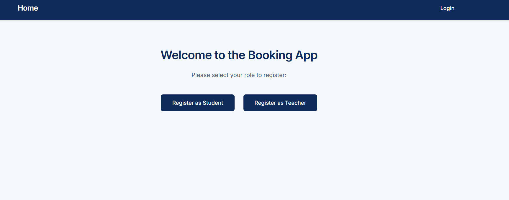
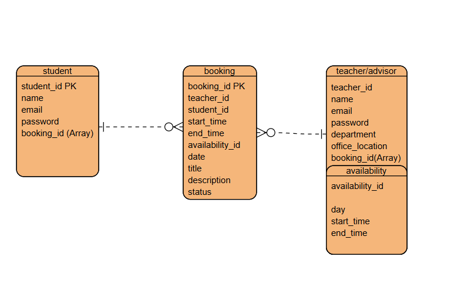

# Meeting Scheduler

### 👤

Created by **Mohamed Rashad Aljoamee**

---

## 📜 Description

Meeting Scheduler is a web application that allows students to easily schedule meetings with teachers. Students can log in, browse teachers, view available time slots, and book appointments.

Teachers can register, set their availability, update or delete time slots, and manage student bookings. Email notifications are automatically sent to teachers and students when meetings are booked, updated, or canceled.

The platform provides a secure and interactive environment for academic scheduling.

---

## 💻 Deployment

- **Frontend:** Hosted on [Surge](https://poly-meeting.surge.sh/)
- **Backend:** Hosted on [Heroku](https://www.heroku.com/)

---

## 🔖 Technologies Used

- **Front-end:** React, CSS, HTML, JavaScript
- **Back-end:** Node.js, Express, MongoDB, Nodemailer

---

## 📊 Project Plan

- **Entity Relationship Diagram (ERD)**  
  

- **Wireframes** (Figma): [Meeting Scheduler Wireframes](https://www.figma.com/)

- **Trello Board:** [Project Board](https://trello.com/b/8B1ChZ32/meeting-scheduler)

- **Backend Repo:** [GitHub - BE](https://github.com/M7139/Meeting-Scheduler-BE)

---

## 🚀 Features

- Student login and profile management
- Teacher registration and profile management
- Browse teachers and view available time slots
- Book and cancel appointments
- Teachers can add, update, or delete availability
- Email notifications for bookings, updates, and cancellations

## 🔮 Future Enhancements

- Sorting or filtering teachers by department
- Implenet MCP by using AI to have a working Chatbot that can book meetings for the students
- Calendar integration for bookings
